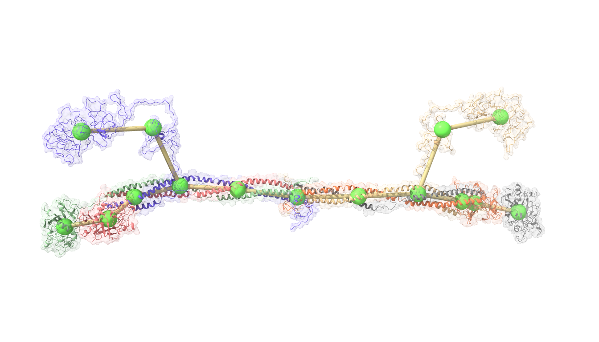

# Multiscale-AI-Coarsening
AI-guided Coarsening Method

## Package Dependencies
- Python >= 3.8
- MDTraj
- pandas
- Pytorch
- sklearn

## Training Pipeline
- Source codes are stored in `src`
- Sample training data are stored in `data`

To initiate training, simply run
```
python -u main_cpu.py > train.log
```

## Simulations
Simulation configuration files are stored in `simulation`.
